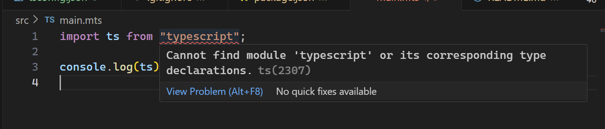
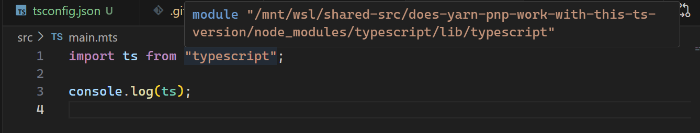

# does-yarn-pnp-work-with-this-ts-version

This is a demonstration repo of yarn plug-n-play with typescript, the vscode sdk, and zipfs extension

Ocassionally, for reasons unknown to man, vscode intellisense will report an error that it could not find a module. But building your project succeeds (modules found).

I've narrowed it down to wether pnp is enabled or not. @yarnpkg fixes it ocassionally, but it's not consistently usable.

## Requirements
- node >= 16.10.0 (for corepack)

## How this repo was generated
1. `mkdir does-yarn-pnp-work-with-this-ts-version && cd does-yarn-pnp-work-with-this-ts-version`
1. \[Optional\] (required if node < 18.0.0) `corepack enable`
1. `yarn init -p`
1. `yarn set version latest`
1. `yarn add -D typescript`
1. `yarn dlx @yarnpkg/sdks vscode`
1. `mkdir src && touch src/main.mts`
1. See below for tsconfig.json

tsconfig.json
```shell
echo '{
  "compilerOptions": {
    "module": "NodeNext",
    "rootDir": "./src",
    "outDir": "./dist",
    "resolveJsonModule": true
  },
  "include": ["./src/**/*.mts"]
}' > tsconfig.json
```

### In vscode
- Ensure the `arcanis.vscode-zipfs` extension is installed
- With a typescript file open (`src/main.mts`), change the typescript version to use the workspace version

## What's broken?
- vscode gives red squiggles and claims that a module could not be found
- but running `yarn build` succeeds no problem, and output is correct



## What single action fixes this?
- `yarn config set nodeLinker node-modules && yarn`
- you'll very likely need to reload your window now



### Troubleshooting
- Restarting typescript language server does not work, it fails to restart
- Reload Window is your friend